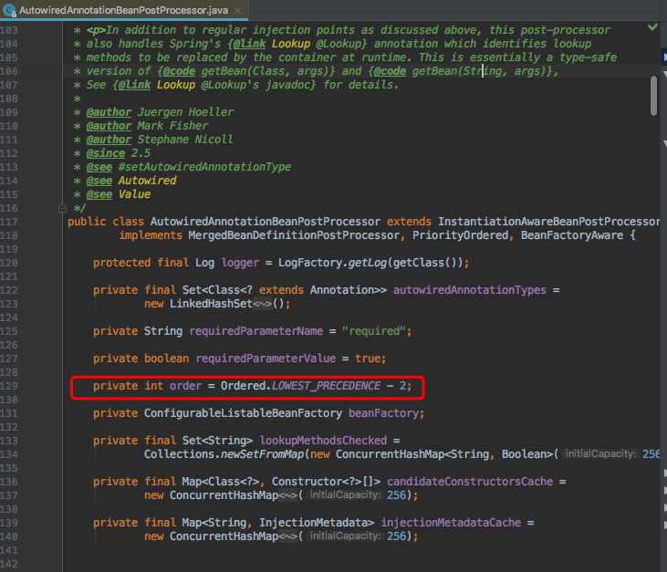

# 背景

springboot1.5.9集成JavaMelody的时候， https://github.com/javamelody/javamelody/blob/without-spring-boot-starter/javamelody-for-spring-boot/src/main/java/hello/JavaMelodyConfiguration.java#L110  发现这种继承方式的配置采用的硬编码方式，不能根据配置文件进行配置。因此我就想将配置方式修改为从配置文件读取，我的第一想法是采用@Value注解，先把一个log参数读取进来，但是发现该参数一直不能生效。

第一步，将monitoringFilter以下的bean都注释掉，该配置就生效了。

第二步，逐步增加注释掉的bean，当去掉SpringDataSourceBeanPostProcessor 和 SpringRestTemplateBeanPostProcessor这两个bean的加载，log参数就加载进来了。

那是什么原因呢？

# 原因探析

1.经过查看源码发现，SpringDataSourceBeanPostProcessor和SpringRestTemplateBeanPostProcessor实现了BeanPostProcessor, PriorityOrdered这两个接口。

2.然后我们就把这种实现方式抽离出来就是AutoConfiguration类的代码实现结构。当我们把实现PriorityOrdered改成实现Ordered接口，发现该问题就解决了。

结论就是实现了BeanPostProcessor, PriorityOrdered这两个接口的bean影响@Value的bean的加载。那么具体是什么时候影响的呢，需要从spring 对BeanPostProcessor的加载研究起。

@Autowired @Value属性都是通过AutowiredAnnotationBeanPostProcessor解析处理的。该后置处理器定义如下。

3.分析BeanPostProcessor的启动时机，及对其依赖的Bean造成的影响。

在AbstractBeanFactory中维护了BeanPostProcessor的列表：
private final List<BeanPostProcessor> beanPostProcessors = new ArrayList<BeanPostProcessor>();

并实现了ConfigurableBeanFactory定义的方法：
void addBeanPostProcessor(BeanPostProcessor beanPostProcessor);

因此我们首先监控AbstractBeanFactory.addBeanPostProcessor()，看看启动过程中谁调用了该方法来注册BeanPostProcessor。发现实例化及注册PostBeanFactory的阶段分为四个：

**第一阶段**是在启动时调用过程会调用AbstractApplicationContext.refresh()，其中的prepareBeanFactory方法中注册了ApplicationContextAwareProcessor、ApplicationListenerDetector：
........
beanFactory.addBeanPostProcessor(new ApplicationContextAwareProcessor(this));
........
beanFactory.addBeanPostProcessor(new ApplicationListenerDetector(this));
........

**然后**在postProcessBeanFactory方法中注册了WebApplicationContextServletContextAwareProcessor：
beanFactory.addBeanPostProcessor(
			new WebApplicationContextServletContextAwareProcessor(this));

**然后**在invokeBeanFactoryPostProcessors方法中调用
PostProcessorRegistrationDelegate.invokeBeanFactoryPostProcessors(beanFactory, getBeanFactoryPostProcessors());

其中对已经注册的BeanFactoryPostProcessors挨个调用其postProcessBeanFactory方法，其中有一个ConfigurationClassPostProcessor，其postProcessBeanFactory方法中注册了一个ImportAwareBeanPostProcessor：

beanFactory.addBeanPostProcessor(new ImportAwareBeanPostProcessor(beanFactory));

**最后**在registerBeanPostProcessors方法中调用
PostProcessorRegistrationDelegate.registerBeanPostProcessors(beanFactory, this);

在该方法中，首先注册BeanPostProcessorChecker：
beanFactory.addBeanPostProcessor(new BeanPostProcessorChecker(beanFactory, beanProcessorTargetCount));

然后分成三个阶段依次实例化并注册实现了PriorityOrdered的BeanPostProcessor、实现了Ordered的BeanPostProcessor、没实现Ordered的BeanPostProcessor，代码如下：

		// Separate between BeanPostProcessors that implement PriorityOrdered,
		// Ordered, and the rest.
		List<BeanPostProcessor> priorityOrderedPostProcessors = new ArrayList<BeanPostProcessor>();
		List<BeanPostProcessor> internalPostProcessors = new ArrayList<BeanPostProcessor>();
		List<String> orderedPostProcessorNames = new ArrayList<String>();
		List<String> nonOrderedPostProcessorNames = new ArrayList<String>();
		for (String ppName : postProcessorNames) {
			if (beanFactory.isTypeMatch(ppName, PriorityOrdered.class)) {
				BeanPostProcessor pp = beanFactory.getBean(ppName, BeanPostProcessor.class);
				priorityOrderedPostProcessors.add(pp);
				if (pp instanceof MergedBeanDefinitionPostProcessor) {
					internalPostProcessors.add(pp);
				}
			}
			else if (beanFactory.isTypeMatch(ppName, Ordered.class)) {
				orderedPostProcessorNames.add(ppName);
			}
			else {
				nonOrderedPostProcessorNames.add(ppName);
			}
		}
	
		// First, register the BeanPostProcessors that implement PriorityOrdered.
		sortPostProcessors(priorityOrderedPostProcessors, beanFactory);
		registerBeanPostProcessors(beanFactory, priorityOrderedPostProcessors);
		
		// Next, register the BeanPostProcessors that implement Ordered.
		List<BeanPostProcessor> orderedPostProcessors = new ArrayList<BeanPostProcessor>();
		for (String ppName : orderedPostProcessorNames) {
			BeanPostProcessor pp = beanFactory.getBean(ppName, BeanPostProcessor.class);
			orderedPostProcessors.add(pp);
			if (pp instanceof MergedBeanDefinitionPostProcessor) {
				internalPostProcessors.add(pp);
			}
		}
		sortPostProcessors(orderedPostProcessors, beanFactory);
		registerBeanPostProcessors(beanFactory, orderedPostProcessors);
		
		// Now, register all regular BeanPostProcessors.
		List<BeanPostProcessor> nonOrderedPostProcessors = new ArrayList<BeanPostProcessor>();
		for (String ppName : nonOrderedPostProcessorNames) {
			BeanPostProcessor pp = beanFactory.getBean(ppName, BeanPostProcessor.class);
			nonOrderedPostProcessors.add(pp);
			if (pp instanceof MergedBeanDefinitionPostProcessor) {
				internalPostProcessors.add(pp);
			}
		}
		registerBeanPostProcessors(beanFactory, nonOrderedPostProcessors);
		// Finally, re-register all internal BeanPostProcessors.
		sortPostProcessors(internalPostProcessors, beanFactory);
		registerBeanPostProcessors(beanFactory, internalPostProcessors);
		// Re-register post-processor for detecting inner beans as ApplicationListeners,
		// moving it to the end of the processor chain (for picking up proxies etc).
		beanFactory.addBeanPostProcessor(new ApplicationListenerDetector(applicationContext));

需要注意的是，除了第一个阶段，其他阶段同一个阶段的BeanPostProcessor是在全部实例化完成以后才会统一注册到beanFactory的，因此，同一个阶段的BeanPostProcessor及其依赖的Bean在实例化的时候是无法享受到相同阶段但是先实例化的BeanPostProcessor的“服务”的，因为它们还没有注册。

从上面调试与源代码分析，BeanPostProcessor的实例化与注册分为四个阶段，第一阶段applicationContext内置阶段、第二阶段priorityOrdered阶段、第三阶段Ordered阶段、第四阶段nonOrdered阶段。而BeanPostProcessor同时也是Bean，其注册之前一定先实例化。而且是分批实例化和注册，也就是属于同一批的BeanPostProcesser全部实例化完成后，再全部注册，不存在先实例化先注册的问题。而在实例化的时候其依赖的Bean同样要先实例化。

因此导致一个结果就是，被PriorityOrderedBeanPostProcessor所依赖的Bean其初始化时无法享受到PriorityOrdered、Ordered、和nonOrdered的BeanPostProcessor的服务。而被OrderedBeanPostProcessor所依赖的Bean无法享受Ordered、和nonOrdered的BeanPostProcessor的服务。最后被nonOrderedBeanPostProcessor所依赖的Bean无法享受到nonOrderedBeanPostProcessor的服务。

所以，自定义实现BeanPostProcessor，PriorityOrdered的Bean无法享受内置的AutowiredAnnotationBeanPostProcessor。

# 解决方案

所以我们一般采用类似HelloProperties的实例化方法和参数调用方式。这样就可以避免因为Bean的实例化顺序问题产生的问题。